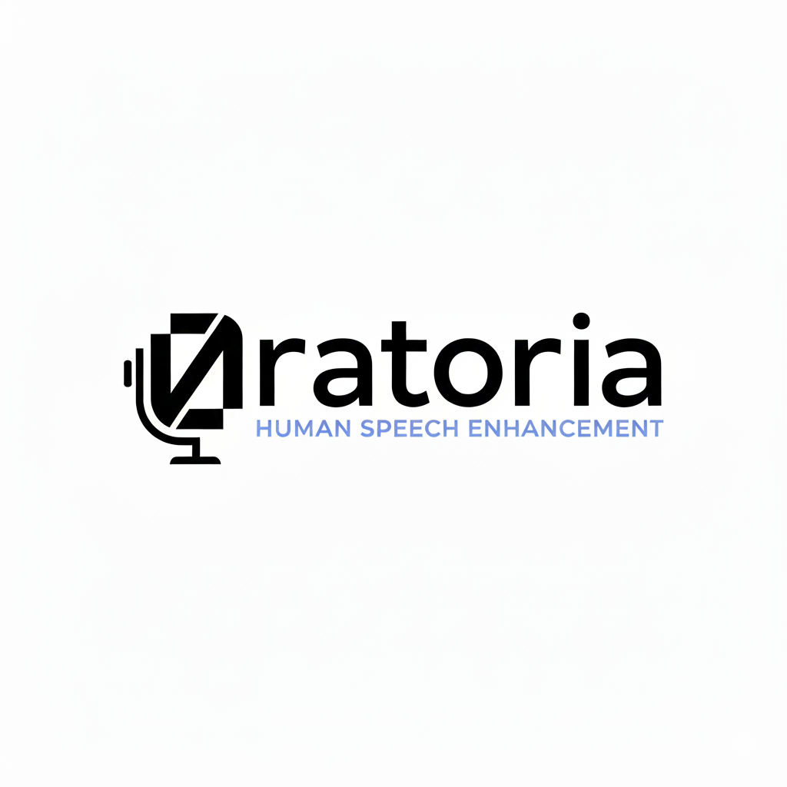

# team-24 Platanus Hack Project

**Current project logo:** project-logo.png

Submission Deadline: 23rd Nov, 9:00 AM, Chile time.

Track: 🦾 human enhancement

team-24

- José Tomás Carrasco ([@jcarrascoa7](https://github.com/jcarrascoa7))
- Oscar Erlandsen ([@oerlandsen](https://github.com/oerlandsen))
- Martín Bórquez ([@borquezmartin](https://github.com/borquezmartin))
- Cristóbal Bofill ([@cbofill3](https://github.com/cbofill3))
- Benjamín Vasquez ([@bvasquezm](https://github.com/bvasquezm))

# 0ratoria - AI Speech Enhancement Platform

AI-powered speech improvement application developed for Platanus Hack 2025. Helps users enhance their public speaking skills through interactive exercises, real-time analysis, and AI-driven speech enhancement.

## Features

### 🎯 Core Functionalities

- **Training Mode**: Complete 3 progressive exercises with real-time feedback
  - Stage 1: Reading - Read text aloud and receive pronunciation accuracy
  - Stage 2: Description - Describe images with vocabulary analysis
  - Stage 3: Q&A - Answer questions with comprehensive evaluation
  
- **AI Speech Enhancement**: Record audio and get AI-cleaned transcription with enhanced audio output
  - Removes filler words and disfluencies
  - Generates cleaner transcription using AI
  - Synthesizes improved speech audio

- **Live Transcription**: Real-time speech-to-text

### 📊 Speech Metrics

- **Clarity**: Transcription precision analysis
- **Rhythm**: Words per minute and filler word detection
- **Vocabulary**: Lexical variability
- **AI Feedback**: Personalized improvement suggestions

### 📱 Progressive Web App (PWA)

- Installable on mobile and desktop
- Offline support via service worker
- Native app experience

Desarrollado con ❤️ para la PlatanusHack 2025
